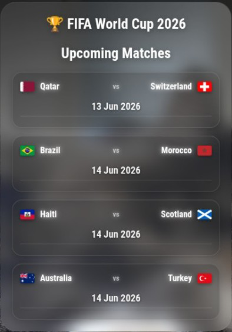
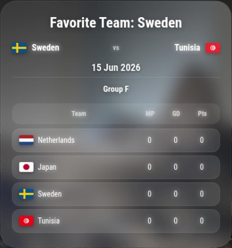
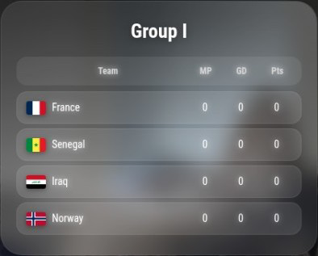
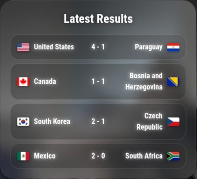
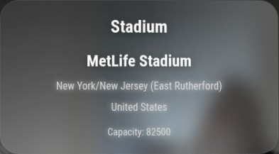

# MMM-WorldCup2026

> ⚠️ This project is no longer actively maintained.
> No new features or bug fixes are planned.

# MMM-WorldCup2026

A modern and feature-rich MagicMirror² module for following the FIFA World Cup 2026 in real time.

Track upcoming fixtures, latest results, group standings, live matches, stadium information and your favorite team directly from your MagicMirror.

The module automatically retrieves the latest World Cup data and presents it in a clean, easy-to-read interface designed specifically for MagicMirror displays.

---

## Features

### Upcoming Matches

View upcoming FIFA World Cup 2026 fixtures including:

* Team names
* National flags
* Match dates

### Favorite Team Tracking

Choose any World Cup team and display:

* The team's next scheduled match
* Current group
* Live group standings

Example:

```javascript
favoriteTeam: "England"
```

Supported examples:

* Sweden
* England
* Germany
* Brazil
* Argentina
* Netherlands
* France
* Spain

Use official FIFA team names in English.

### Group Standings

Automatically rotates through all FIFA World Cup groups and displays:

* Matches Played (MP)
* Goal Difference (GD)
* Points (Pts)

### Latest Results

Displays the ten most recent completed matches.

### Stadium Information

Browse all official FIFA World Cup 2026 stadiums including:

* Stadium name
* Host city
* Host country
* Capacity

### Live Match Detection

When a match is in progress, the module automatically switches to a LIVE view displaying:

* Current score
* Match minute

### Automatic Updates

World Cup data is refreshed automatically at configurable intervals.

### Lightweight & Dependency-Free

* Uses the built-in Node.js Fetch API
* No external HTTP libraries required
* No additional runtime dependencies

---

## Screenshots

### Upcoming Matches



### Favorite Team



### Group Standings



### Latest Results



### Stadium Information


```

## Installation

Navigate to your MagicMirror modules folder:

cd ~/MagicMirror/modules
```

Clone the repository:

```bash
git clone https://github.com/dentrass/MMM-WorldCup2026.git
```

Enter the module directory:

```bash
cd MMM-WorldCup2026
```

Install dependencies:

```bash
npm install
```

```
Uses the built-in Node.js Fetch API. No external HTTP libraries required.
```

---

## Configuration

Add the module to your MagicMirror `config.js` file:

```javascript
{
    module: "MMM-WorldCup2026",
    position: "top_right",
    config: {
        favoriteTeam: "Sweden",
        updateInterval: 300000,
        rotateInterval: 20000,
        maxMatches: 5
    }
}
```

---

## Configuration Options

| Option         | Default  | Description                                 |
| -------------- | -------- | ------------------------------------------- |
| favoriteTeam   | "Sweden" | Team displayed in the Favorite Team view    |
| updateInterval | 300000   | Data refresh interval in milliseconds       |
| rotateInterval | 20000    | Time between view rotations in milliseconds |
| maxMatches     | 5        | Number of upcoming matches displayed        |

---

## Folder Structure

```text
MMM-WorldCup2026
│
├── MMM-WorldCup2026.js
├── MMM-WorldCup2026.css
├── node_helper.js
├── package.json
├── README.md
├── LICENSE
│
└── flags/
```

---

## Requirements

* MagicMirror²
* Node.js 18+ (uses the built-in Fetch API)
* Internet connection

---

## Dependencies

No external HTTP libraries are required.

The module uses the built-in Fetch API available in Node.js 18+.

Install the module with:

```bash
npm install
```

---

## Data Source

World Cup data is retrieved automatically from publicly available FIFA World Cup 2026 data sources.

The module currently provides:

* Fixtures
* Results
* Group standings
* Team information
* Stadium information

No API key is required.

---

## License

This project is licensed under the MIT License.

See the LICENSE file for details.

---

## Support

If you encounter a bug or would like to request a feature, please open an issue on GitHub:

https://github.com/dentrass/MMM-WorldCup2026/issues

This project was created specifically for the FIFA World Cup 2026. While active maintenance may be limited after the tournament concludes, bug reports and suggestions are always welcome.

---

## Author

Johan Ornell (Dentrass)

Created for the MagicMirror² community.
